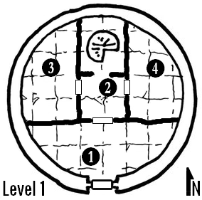

Where Condors Dare
==================

Introduction
------------

**Where Condors Dare** is an adventure for 4-6 beginning characters, 
designed to be completed within three to four hours. 
It's written for an experienced Keeper running a convention game for a few people
that could have no prior experience with the game.

Each of the six following sections is design to last for 30 to 40 minutes.
The structure of the adventure allows to split it into two sessions of less than two hours,
ending the first session after the escape plan is revealed (see **The Prison Beyond**).

The Mountain Crossing
---------------------

The Uncovered Tower
-------------------

Description of the tower's entrance. Pile of rocks, small opening because a part of the door was smashed in.
After climbing the rocks, one needs to crawl into the opening and drop to the floor - not a big drop, but makes
getting out a bit cumbersome (especially when pursued).

#### 1. Entrance Hall

---

*You drop five feet down through the opening. The right wing of the door lies nearby, covered with debris. As your feet touch the dusty floor, it lights up. The stone floor is engraved with shining floral patterns, covering the whole area, like veins of liquid silver. The light is dim, but it's enough not to trip over the rocks and to notice that the room is slightly larger than it seemed from the outside of the tower.*

---

This is a high-ceilinged room, with two wrought iron benches and a closed metal door to the north.
Anyone with the proper knowledge can recognize the patterns as high elven.
Examining the patterns reveals that some of the leaf like shapes are actually blades.
The door north is closed, but not locked.

#### 2. Stairway 

---

*The iron door opens into a small room with similar doors to the east and west, and an archway to the north.*

---

The archway to the north is partially obscuring a set of stairs that spiral up to the first floor. The floor patterns from the Entrance Hall extend here too, illuminating the room with faint light.

#### 3. Scriptorium

---

*This dimly lit chamber is littered with dusty stacks of paper. You notice two bookshelves and an armchair to your left, but then, your eyes are drawn to sudden movement to your right, where several hand-shaped creatures jump down from three writing desks and rush towards you with reckless abandon.*

---

The creatures are six **quillhands**, tasked with making copies of a few manuscripts, and never called off. Their ink supply ran off years ago, and they see the characters as a source of fresh, red ink. The quillhands will attack with the aim to draw blood. Once blood is drawn after a successfull attack, the quillhands will automatically drain blood on the next round, and then return to their task, filled with ink and furiously scribbling. The blood supply will last them for an hour.

**Quillhands** AC: 16; HD: 1d6; HP: 3,4,3,2,3,4; Dmg: 1d2; SV: physical; Special: if a quillhand successfully attacks a creature, it attaches itself and drains blood the following round, dealing 1 point of damage. It does so for a single round and then, filled, returns to its activities.

In the southwest corner of the room, there are two bookshelves, with a cushioned reading armchair between them. 

The bookshelves contain volumes filled with strange formulae, in various languages, most of them unrecognizable. A careful search will reveal a few tomes in something resembling High Elven. Anyone who understands an elven language can discern that the books all deal with shaping metal, alchemy and forging processess, with the exception of a small, worn tome titled "The Lust Lizards of Melancholy Cove".

The armchair between the bookshelves is very comfortable. Its hinged left arm lifts up to reveal a hidden storage compartment, holding a decanter set of exquisite quality (emerald glass, silver, amethyst - decanter worth 100gp, two glasses worth 25gp each). The decanter is half filled with plum wine that tastes like gazing at starlight while someone smashes your head with a large gold brick.

#### 4. Training Room

The sorcerer's gym. Cheesy motivational poster in high elvish.

A fencing dummy stands in a corner, armed with two blades that look like fine, expensive stuff, but it's hard to be sure without getting closer.

Upon closer examination, yes, it's a blade trap - the dummy attacks. Treat as a +1 attack, but a successful dexterity save will give the dummy a -4 penalty to hit.

Magyar fencing mannequin of Toldi, Toldi bábú, as visual reference - two sabres.

Something of value here - a magical powder that sharpens every blade, even old and rusted ones? 

#### 5. The Sorcerous Study

- bookshelves
- fancy stuff
- image on the wall
- shows treasure in a room, seems to be alive
- examining the image calls for a wisdom check, players will think it's perception, but it's a willpower test
- failure means the character can't resist touching the image
- touching the image sucks all living creatures in the room inside the image, to a space beyond space

The Prison Beyond
-----------------

River God's Favor
-----------------

    Looking into the portal reveals a dark forest, thick with gnarled trees. 
    There's a glimmer of blue running through the green, a rushing river 
    that stubbornly reflects the sky above the treetops.

As the characters examine the first portal, [INSERT WIZARD NAME HERE] speaks:

> If we want to escape, we need to shake the very foundations of this mountain. I need you to make an offering to the old gods.
> What you see beyond this portal is a good place for a sacrifice to the River God. 

Portal Location 2
-----------------

Portal Location 3
-----------------

Conclusion
----------

Appendix A - New Monsters
-------------------------

### Quillhand

