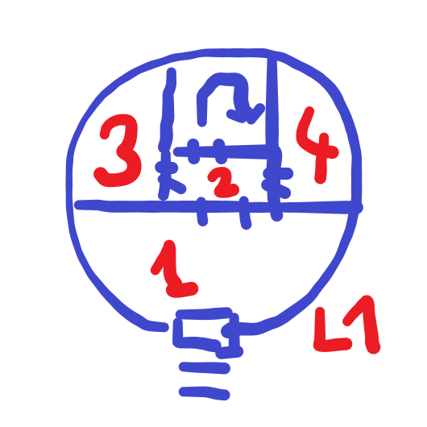

Where Condors Dare
==================

Introduction
------------

**Where Condors Dare** is an adventure for 4-6 beginning characters, 
designed to be completed within three to four hours. 
It's written for an experienced Keeper running a convention game for a few people
that could have no prior experience with the game.

Each of the six following sections is design to last for 30 to 40 minutes.
The structure of the adventure allows to split it into two sessions of less than two hours,
ending the first session after the escape plan is revealed (see **The Prison Beyond**).

The Mountain Crossing
---------------------

The Uncovered Tower
-------------------

Description of the tower's entrance. Pile of rocks, small opening because a part of the door was smashed in.
After climbing the rocks, one needs to crawl into the opening and drop to the floor - not a big drop, but makes
getting out a bit cumbersome (especially when pursued).

#### 1. Entrance Hall

High-ceilinged, a bit dirty, dust and rocks fell through the opening. Magically lights up.

#### 2. Stairway 

Small room with closed doors on both sides and an archway partially obscuring a staircase leading up.

#### 3. Training Room

The sorcerer's gym. Cheesy motivational poster in high elvish.

A fencing dummy stands in a corner, armed with two blades that look like fine, expensive stuff, but it's hard to be sure without getting closer.

Upon closer examination, yes, it's a blade trap - the dummy attacks. Treat as a +1 attack, but a successful dexterity save will give the dummy a -4 penalty to hit.

Magyar fencing mannequin of Toldi, Toldi bábú, as visual reference - two sabres.

Something of value here - a magical powder that sharpens every blade, even old and rusted ones? 

#### 4. Scriptorium

Half a dozen hands with sharp metal quills, tasked with making copies of a few manuscripts and never called off.
Stacks of written paper sheets copied until the ink supply ran out.

The hands with see the characters as a source of fresh, red ink, and will attack with the aim to draw blood.
Once blood is drawn, the quillhands will automatically suck for a round, then return to their task, furiously scribbling.

Something like 1d2 damage, a second 1d2 unless pulled out with a successful STR check, so max 2d2 and out of action (blood should last for an hour).

#### 5. The Sorcerous Study

- bookshelves
- fancy stuff
- image on the wall
- shows treasure in a room, seems to be alive
- examining the image calls for a wisdom check, players will think it's perception, but it's a willpower test
- failure means the character can't resist touching the image
- touching the image sucks all living creatures in the room inside the image, to a space beyond space

The Prison Beyond
-----------------

River God's Favor
-----------------

    Looking into the portal reveals a dark forest, thick with gnarled trees. 
    There's a glimmer of blue running through the green, a rushing river 
    that stubbornly reflects the sky above the treetops.

As the characters examine the first portal, [INSERT WIZARD NAME HERE] speaks:

> If we want to escape, we need to shake the very foundations of this mountain. I need you to make an offering to the old gods.
> What you see beyond this portal is a good place for a sacrifice to the River God. 

Portal Location 2
-----------------

Portal Location 3
-----------------

Conclusion
----------
